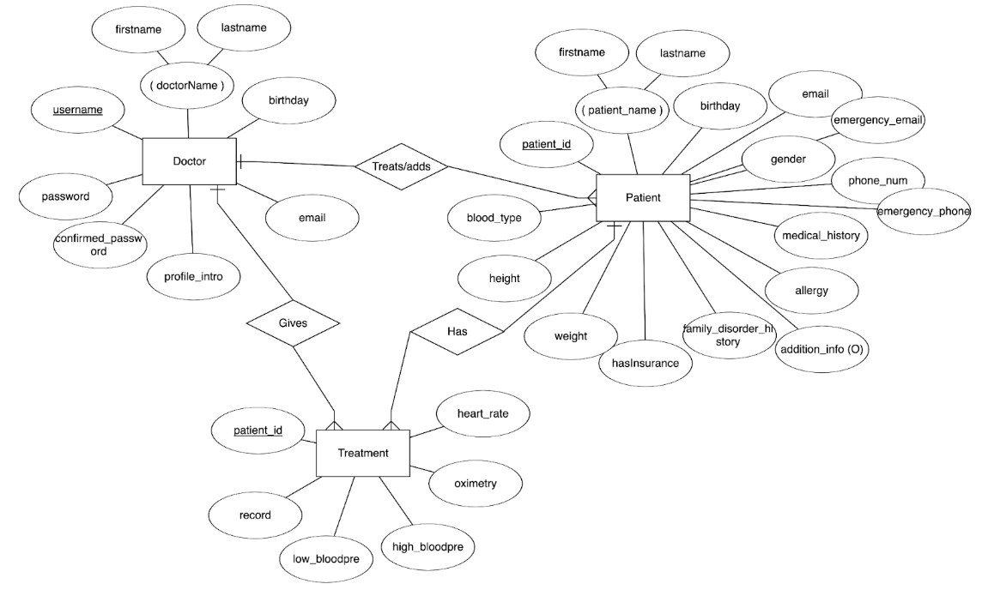

# Data Analysis Portfolio

## 1. Data Processing in Python
**Goal**: To preprocess and analyze detailed student clicking stream data from an online assessment platform. The objective is to extract behavioral patterns (like excessive attempts, speed, calculator usage, etc.), compute final grades, and label students based on their testing duration for use in machine learning and further  research.

**Input**: `data_all.json`  contains detailed logs for each student, including per-question interaction stats, time deltas, and assistive tool usage.

**Output**: `processed_data_2w.json` is a JSON file includes these derived features and labels like test grades, tool usage (e.g., calculator), time spent, visit frequency, and behavioral flags.

**Python Script**: [data_process (1).py](https://github.com/yding0128/Portfolio-/blob/main/data_process%20(1).py)

**Final Report**: [ML Model Based Students Online Exam Behaviors Prediction Final Report.pdf](https://github.com/yding0128/Portfolio-/blob/main/ML%20Model%20Based%20Students%20Online%20Exam%20Behaviors%20Prediction%20Final%20Report.pdf)

## 2. Data Processing in SQL
**Goal**: This collection of SQL queries focuses on analyzing relationships between employees, departments, and work assignments within an organizational database.

**Dataset**: Relational schema 
- `Emp`: Employee details (eid, ename, age, salary)
- `Dept`: Department info (did, dname, budget, managerid)
- `Works`: Assignment data (eid, did, pct_time)

**Tasks**: Filter by department budget, name, and time allocation; Identify patterns in employee roles and manager responsibilities; Aggregate data to find averages, totals, and counts

**Code Samples**: [Q4.sql](https://github.com/yding0128/Portfolio-/blob/main/Q4.sql), [Q5.sql](https://github.com/yding0128/Portfolio-/blob/main/Q5.sql), [Q7.sql](https://github.com/yding0128/Portfolio-/blob/main/Q7.sql), [Q8.sql](https://github.com/yding0128/Portfolio-/blob/main/Q8.sql)

## 3. Database Design
**Goal**: Build a Patient Tracker System, which is designed for doctors and healthcare professionals for data recording. This digital system replaces traditional paper records and allows doctors to access patient records remotely and update the database in real time. 

**Entity-Relationship Diagram (ERD)**

**Relational Schema**

**Software Development Report**: [Patient Tracker System Report.pdf](https://github.com/yding0128/Portfolio-/blob/main/Patient%20Tracker%20System%20Report.pdf)

## 4. Dashboard Development for Salary Analysis
**Goal**: To create a dashboard for analyzing the correlation between states, graduation number/rate, and compensation with a focus on identifying high and low-paying jobs in the job market and understanding the influence of graduation on state annual earnings

**Conclusion**: States with higher graduation numbers and rates tend to have a higher annual state earning

**Report**: [Final PowerPoint Report ](https://github.com/yding0128/Portfolio-/blob/main/Salary%20Analysis%20-%20Final%20PowerPoint%20Report.pdf)

## 5. Case Study - Airbnb Visual Insights
**Goal**: Create visually effective charts to explore trends in listing count, room types, prices, and user reviews

**Charts**:
  - `Bar Chart`: Properties per neighborhood (colored by avg. minimum nights)
  - `Column Chart`: Average minimum stay by room type (color emphasized)
  - `Symbol Map`: Reviews by location in Antwerp (bubble size = reviews, color = room type)
  - `Line Chart`: Listings over time by latest review year (styled purple/blue)
  - `Histogram`: Rental price distribution (filtered ≤ €1000, color by room type)
  - `Scatterplot`: Price vs. reviews per month (filtered, color by room type)

**Report**: [Case Study - Airbnb.pdf](https://github.com/yding0128/Portfolio-/blob/main/Case%20Study%20-%20Airbnb.pdf)

## 6. Case Study - Business & Population Mapping in U.S.
**Goal**: Validates data integrity and uncovers insights about business distribution and entrepreneurship across U.S. states

**Tables**:
  - `Table 1`: Establishments by state abbreviation
  - `Table 2`: Establishments by state name (joined)
  - `Table 3`: Per capita business measure

**Visuals**:
  - `Scatterplot 1`: Population vs. total establishments
  - `Scatterplot 2`: Population vs. small businesses (`n<5`)

**Report**: [Case Study - Business & Population Mapping in U.S.pdf](https://github.com/yding0128/Portfolio-/blob/main/Case%20Study%20-%20Business%20%26%20Population%20Mapping%20in%20U.S..pdf)
 

## 7. Case Study - Pivot Tables 
**Goal**: Create a PivotTable in Microsoft Excel to analyse the data using multi-dimensional reporting

**Dataset**: `BicycleCompanyDEValues`   contains raw transactional data for a bicycle company. It includes 48,244 rows, each representing an individual sales record. 

**Worksheet C1-5**: Sales by Product Group & Sales Organization
- Show total revenue by `Material Group` and `Sales Organization`  (Berlin, Magdeburg, Munich).
  - Filtered to show only:
    - Sales channel `DistrChan` = Internet  
    - Sales  `Date` = January to March 2007 (Q1)
  - Format revenue as Euro (€), no decimals.
  - Helps analyze revenue trends by group and location for Q1 Internet sales.

**Worksheet C1-6**: Contribution Margin Ratio by Product  
  - Rows include `MaterialCode` and `Material` (product name)
  - Add calculated fields:
    1. `Net Sales` = Revenue - Discount  
    2. `Contribution Margin` = Net Sales - Cost of Goods Sold  
    3. `Contribution Margin Ratio` = Contribution Margin / Net Sales (format as %)
  - Sort by Contribution Margin Ratio (descending).
  - Highlight the product with the highest margin ratio.
  - Identifies the most profitable product by percentage margin.

**Excel Sheets**: [CS_PivotTable.xlsx](https://github.com/yding0128/Portfolio-/blob/main/CS_PivotTable.xlsx)
